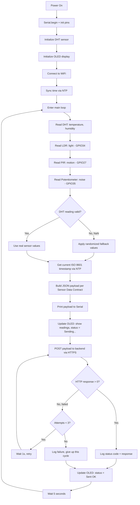

# Firmware Flowchart - Youverse

## Key Design Decisions

- **Retry logic:** up to 3 attempts per transmission cycle with a 1-second backoff, so transient WiFi/network issues don't silently drop data.
- **Fallback values:** only triggered when the DHT sensor read fails (`NaN`), preventing invalid payloads from being sent — does not affect real, valid sensor readings (light, motion, noise are read from real hardware every cycle regardless).
- **Local feedback loop:** the OLED display updates both before and after each transmission attempt (`Sending...` → `Sent OK`), giving immediate visual confirmation the device is alive and communicating, without needing a connected computer/serial monitor.
- **Sampling rate:** fixed at 5 seconds, matching the agreed Sensor Data Contract with the backend team.
